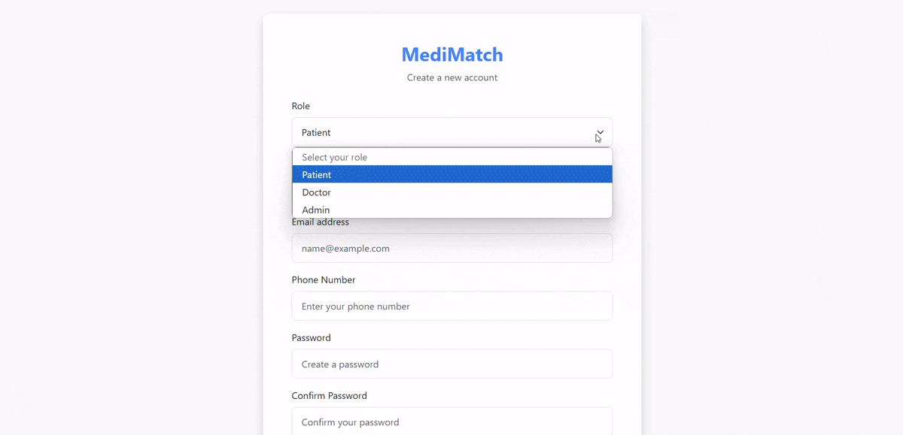
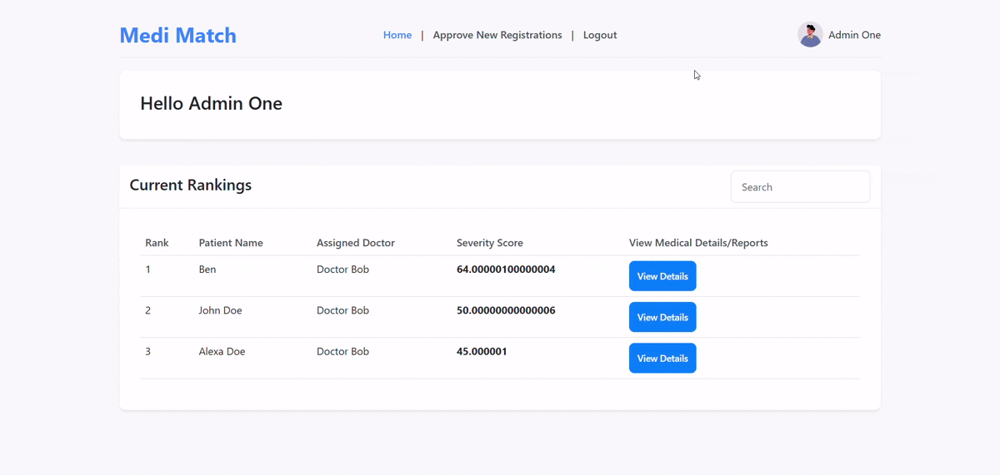
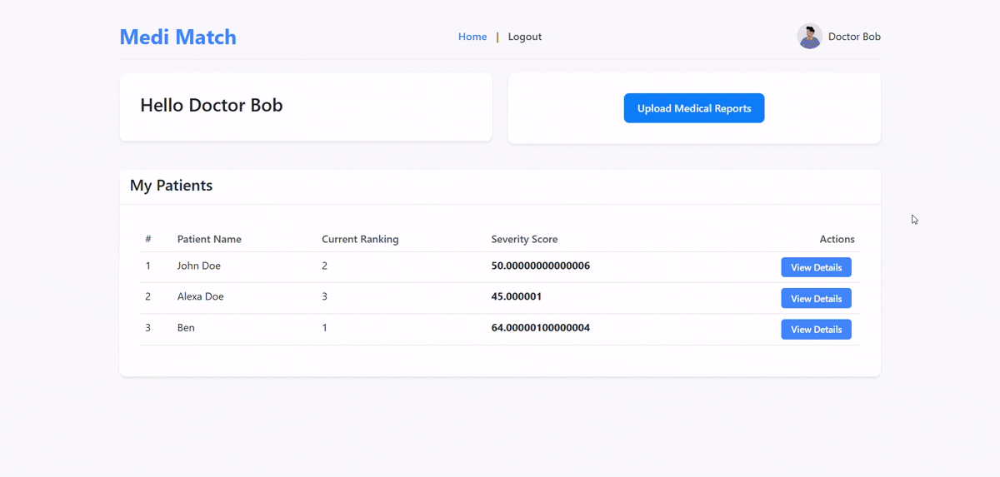
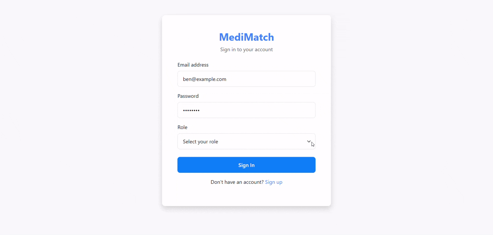

# MediMatch 🫀

<div align="center">
  
[](https://youtu.be/yamayZwaPnc?si=NqSSQ1kXunoEFqr0)
[](https://www.typescriptlang.org/)
[](https://developer.mozilla.org/en-US/docs/Web/JavaScript)
[](https://www.python.org/)
[](https://developer.mozilla.org/en-US/docs/Web/HTML)
[](https://developer.mozilla.org/en-US/docs/Web/CSS)

</div>

## 🌟 Overview

MediMatch is an innovative AI-powered organ transplant prioritization system that revolutionizes how organ transplant waiting lists are managed. By leveraging advanced Generative AI technology, it ensures that patients with deteriorating conditions receive the priority they urgently need, potentially saving countless lives through more efficient and fair organ allocation.

## 💡 Solution

MediMatch addresses these challenges through:

1. **AI-Powered Severity Assessment**:

   - Analyzes patient medical reports using Generative AI
   - Automatically generates severity scores based on current health conditions
   - Continuously updates patient priority in real-time

2. **Dynamic Priority System**:
   - Automatically adjusts patient positions in waiting lists
   - Ensures critical cases receive immediate attention
   - Maintains fair and transparent prioritization

## ✨ Key Features

### For Healthcare Providers 👨‍⚕️

- **Report Upload Interface**: Easily upload patient medical reports
- **AI Analysis Dashboard**: View AI-generated severity assessments
- **Priority Tracking**: Monitor patient positions on waiting lists
- **Real-time Updates**: Instant notifications for priority changes

### For Transplant Centers 🏥

- **Priority List Management**: AI-driven waiting list organization
- **Patient Status Overview**: Comprehensive view of all listed patients
- **Automated Prioritization**: Smart queuing based on severity scores
- **Analytics Dashboard**: Insights into waiting list dynamics
- **Emergency Alerts**: Immediate notification for critical cases

### AI Capabilities 🤖

- **Report Analysis**: Advanced GenAI processing of medical reports
- **Severity Scoring**: Complex evaluation of patient conditions
- **Priority Calculation**: Algorithmic determination of waiting list position

## 🛠️ Technology Stack

- **Frontend**:

  - JavaScript for client-side logic
  - HTML, CSS and Bootstrap user interface

- **Backend**:

  - Node.js and Express.js main server
  - Python for operations and AI processing
  - MongoDB for storing patient and doctors records
  - Secure API endpoints for sensitive medical data

- **AI/ML**:
  - Generative AI (Llama3.2) for medical report analysis

## 🔒 Security & Compliance

- Secure storage for medical records
- Secure authentication system
- Secured routes

## 🚀 Getting Started

1. Clone the repository

```bash
git clone https://github.com/satwikkaushik/MediMatch.git
```

2. Install dependencies

```bash

# Backend dependencies
cd backend
npm install

# GenAI dependencies
cd backend/agent
pip install -r requirements.txt
```

3. Configure environment variables

```bash
cp .env.example .env
# Add your configuration details
```

4. Run the application

```bash
# Start frontend
npm start

# Start backend
python app.py
```

## 📱 Preview






<div align="center">
  <a href="https://youtu.be/yamayZwaPnc?si=NqSSQ1kXunoEFqr0" target="_blank">
    Click to watch the full demonstration video
  </a>
</div>

## 🤝 Contributing

We welcome contributions to improve MediMatch! Please:

1. Fork the repository
2. Create a feature branch
3. Commit your changes
4. Push to the branch
5. Submit a pull request

## 👥 Team

- **Backend Developed by**: [Satwik Kaushik](https://github.com/satwikkaushik)
- **AI/ML Developed by**: [Sujal Maheshwari](https://github.com/sujal-maheshwari2004)
- **Frontend Developed by**: [Khushi Kumari Jha](https://github.com/khushijha-kj)

---

<div align="center">
  Made with ❤️ for better healthcare
</div>
